# Pupil Labs Marker

## Workspace with ArUco and AprilTag Markers

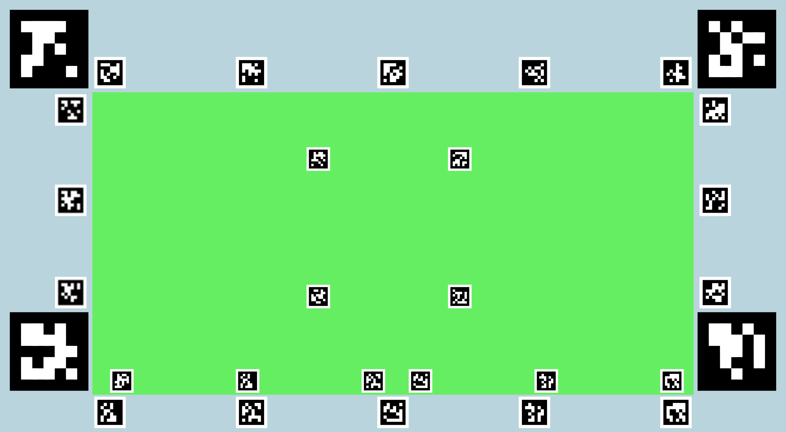 

 - 4 ArUco markers uwed by the robot camera.
 - 9 AprilTag markers used by the wearable eye trackers.  These markers are used to define the tracking area.
 
### ArUco Markers

  
See details

There are 4 10x10 cm markers:

* <b>ID = 0</b>
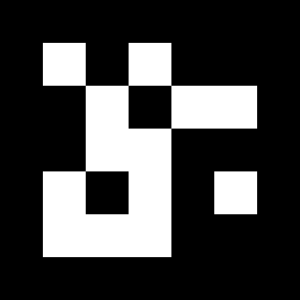 
* <b>ID = 2</b>
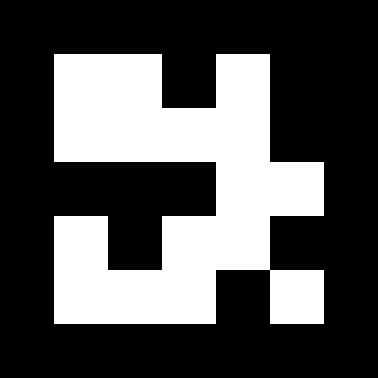 
* <b>ID = 4</b>
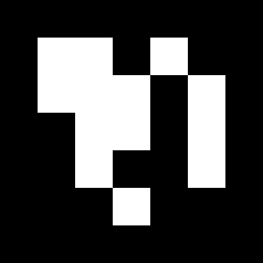 
* <b>ID = 12</b>
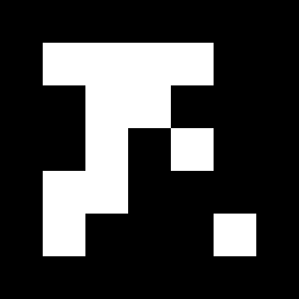 

  

  
### AprilTag Markers

  
See details

There are 2 10x10 cm markers on the sides of the workspace:

* <b>ID = 16</b>
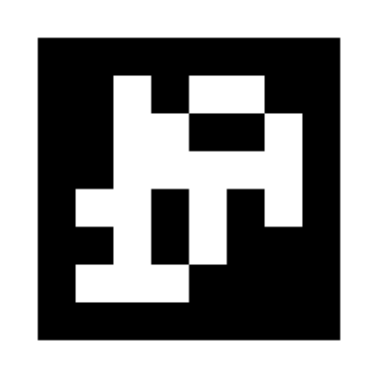 
* <b>ID = 17</b>
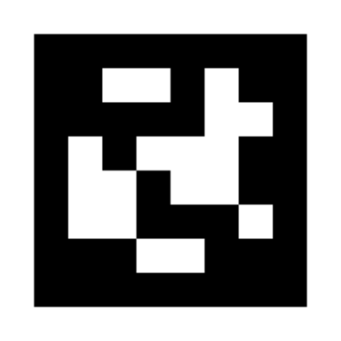

There are 7 7x7 cm markers on top of the workspace:

* <b>ID = 18</b>
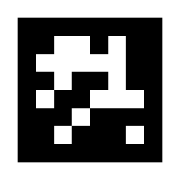 
* <b>ID = 19</b>
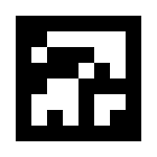
* <b>ID = 20</b>
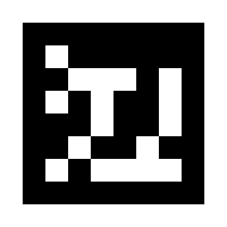 
* <b>ID = 21</b>
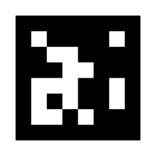
* <b>ID = 22</b>
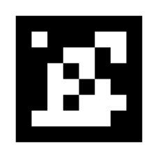 
* <b>ID = 23</b>
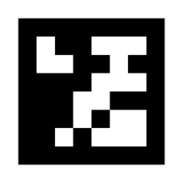
* <b>ID = 24</b>
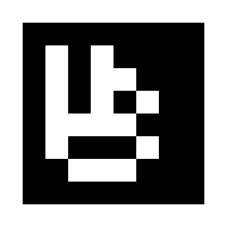 

  
